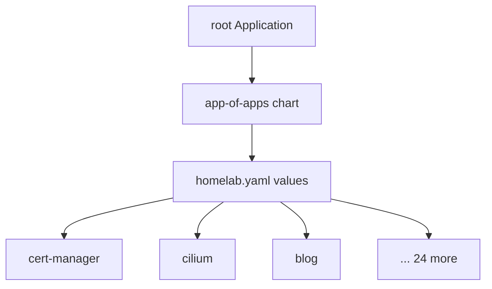

For about a year the cluster was configured by whichever terminal I happened to
be sitting at. There was a directory of manifests, and applying them was
something I did by hand and remembered imperfectly. The problem was never that
this failed. The problem was that I could not answer the question "what is
running right now, and why".

## One root, many leaves



The whole cluster is described by one values file. Each entry names a chart, a
version, a namespace and a sync wave. A local chart iterates over those entries
and emits one Application per app. Adding a workload means adding roughly eight
lines to a YAML map, and nothing else.

## Sync waves are ordering, not scheduling

The part I got wrong initially was treating sync waves as a scheduling
mechanism. They are not. A wave does not start until the previous one reports
healthy, which means a workload with a broken health check blocks everything
behind it indefinitely.

Cert-manager sits in an early wave because half the cluster wants certificates.
Anything with an ingress sits late. The blog sits at wave one hundred, which is
deliberately far from everything else: if it fails, nothing else notices.

## Server-side apply, everywhere

```yaml
syncOptions:
  - ApplyOutOfSyncOnly=true
  - PruneLast=true
  - CreateNamespace=true
  - ServerSideApply=true
```

`ServerSideApply` matters more than the rest combined. Several charts ship
custom resource definitions large enough to exceed the annotation size limit
that client-side apply relies on. Without it, those applications fail in a way
whose error message points nowhere useful.

## What changed

The cluster is now reproducible from an empty machine and a git clone. More
usefully, every change has an author and a diff. When something breaks, the
first question is no longer "what did I do" but "which commit", and that is a
question with an answer.
