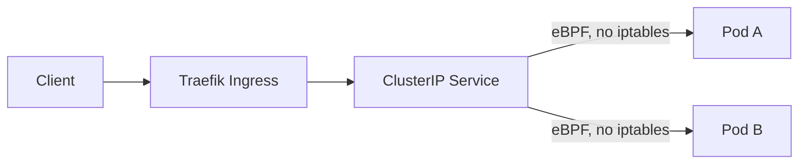

kube-proxy works. That is worth saying before anything else, because replacing
a component that works is a choice you should be able to justify. My
justification was that I wanted to understand the datapath, and the fastest way
to understand something is to remove the layer you have been ignoring.

## What the datapath looks like



With kube-proxy in iptables mode, a service lookup walks a chain of rules that
grows with the number of services. Cilium replaces that with an eBPF map lookup
attached to the socket, so the cost stops scaling with cluster size. On a
three-node homelab this makes no measurable difference, which is worth being
honest about. I did not do this for performance.

## The setting that broke DNS

Installing with `kubeProxyReplacement` enabled requires telling Cilium how to
reach the API server, because there is no kube-proxy left to provide the
in-cluster service address it would normally use. Miss that and the agents come
up, report healthy, and fail to program anything.

The symptom was DNS resolving intermittently. Pods on one node worked, pods on
another did not, and the pattern shifted every time an agent restarted. I spent
a long time looking at the DNS deployment before checking whether the agents
had ever successfully connected upstream.

```yaml
kubeProxyReplacement: true
k8sServiceHost: 10.0.0.10
k8sServicePort: 6443
```

## What I actually gained

Hubble. Being able to watch flows between pods, with identities attached rather
than raw addresses, changed how I debug the cluster. When something cannot
reach something else, I no longer guess. That observability, not throughput, is
the reason I would make the same choice again.

The [cluster bootstrap](/posts/bootstrapping-k0s-with-ansible/) has to be in
place before any of this applies.
